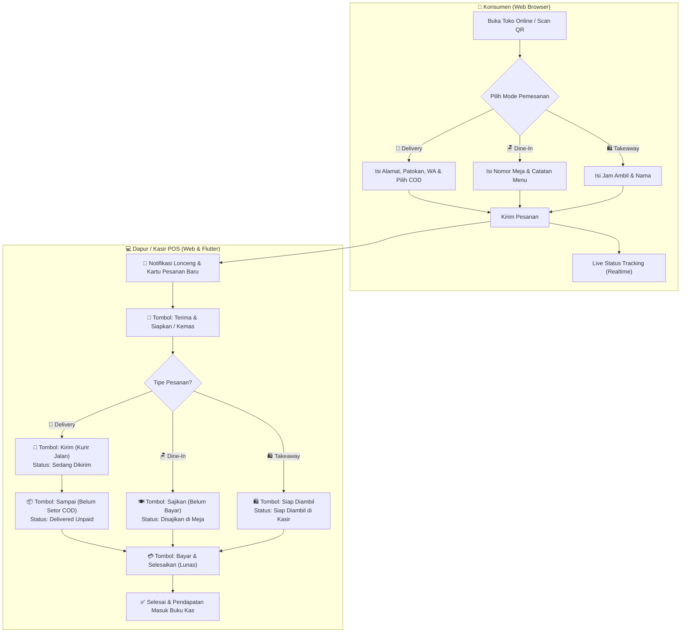
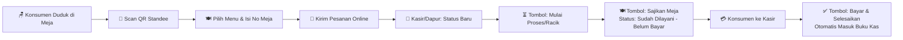

# DuitKu — Aplikasi Manajemen Keuangan Pribadi & Usaha UMKM (POS)

**DuitKu** adalah ekosistem manajemen finansial all-in-one yang terdiri dari **Backend API berbasis CodeIgniter 4**, **Progressive Web App (PWA)**, dan **Aplikasi Mobile Native Flutter (Android)**. 

Dirancang secara modern, cepat, dan mobile-friendly untuk mencatat keuangan pribadi, mengelola multi-rekening dompet, memantau tagihan & hutang, melacak perawatan kendaraan, hingga mengelola **Kasir Cepat Mini (POS), Stok Barang & Laporan Laba Rugi untuk Coffee Shop, Toko Kelontong, dan UMKM**.

<p align="center">
  
  
  
  
  
  
  
</p>

---

## 📥 Panduan Unduh & Install APK dari Menu Release GitHub

Bagi pengguna Android yang ingin menginstall aplikasi native DuitKu langsung tanpa build sendiri dari source code:

### 1. Buka Halaman Releases
* Buka tab **[Releases](https://github.com/zusfan-ops/duitku/releases)** pada repository GitHub DuitKu.
* Pilih versi rilis terbaru (Latest Release).

### 2. Pilih File APK yang Sesuai dengan Perangkat Anda

| Nama File APK | Arsitektur CPU | Rekomendasi Penggunaan | Ukuran |
|---|---|---|---|
| **`app-arm64-v8a-release.apk`** | **ARM 64-bit** | ⭐ **Sangat Direkomendasikan** untuk 95%+ smartphone Android modern (keluaran 2018 ke atas: Samsung, Xiaomi, Oppo, Vivo, Realme, dll). Ukuran aplikasi jauh lebih ringan dan performa maksimal. | **~35 MB** |
| **`app-armeabi-v7a-release.apk`** | **ARM 32-bit** | Untuk smartphone Android tipe lama atau entry-level 32-bit. | **~32 MB** |
| **`app-x86_64-release.apk`** | **x86 64-bit** | Untuk emulator Android di PC (NoxPlayer, BlueStacks, LDPlayer, Android Studio Emulator). | **~38 MB** |
| **`app-release.apk`** | **Universal** | Berisi seluruh pustaka arsitektur gabungan (kompatibel untuk segala jenis perangkat Android). | **~82 MB** |

### 3. Langkah-Langkah Pemasangan (Install):
1. **Unduh APK:** Klik salah satu file APK di atas (direkomendasikan `app-arm64-v8a-release.apk`) untuk mulai mengunduh ke ponsel Anda.
2. **Izinkan Instalasi dari Sumber Tak Dikenal:**
   - Buka file APK yang telah diunduh via notifikasi atau File Manager.
   - Jika muncul peringatan keamanan *"Demi keamanan, ponsel Anda tidak diizinkan memasang aplikasi yang tidak dikenal dari sumber ini"*, klik **Setelan (Settings)** $\rightarrow$ aktifkan toggle **"Izinkan dari sumber ini" (Allow from this source)**.
3. **Pasang Aplikasi:** Klik tombol **Install / Pasang**, tunggu proses instalasi selesai, lalu klik **Buka (Open)**.
4. **Login / Registrasi:** Masuk dengan akun yang telah dibuat atau daftar akun baru untuk mulai mencatat.

---

## ✨ Fitur-Fitur Utama & Fungsi

### 🛍️ 1. Suite Usaha, Kasir Mini POS & Marketplace Online Shop (Delivery / Takeaway / Dine-In)
*Khusus dirancang ramah layar sentuh smartphone (*mobile-first*) untuk pengusaha Coffee Shop, Kedai Kopi, Warung Makan, Toko Kelontong, Retail, dan UMKM.*
- **Toko Online & Marketplace Publik UMKM:** Konsumen dapat mengakses toko online dari rumah via tautan web `domain/menu/namatoko` (atau alias `/shop/namatoko` / `/toko/namatoko`) untuk berbelanja produk makanan/sembako kapan saja tanpa perlu login/instal aplikasi.
- **3 Mode Pemesanan Lengkap (*Fulfillment*):**
  1. 🛵 **Delivery (Kirim ke Rumah):** Konsumen memasukkan nama, nomor WhatsApp aktif, alamat pengiriman lengkap, patokan kurir, dan otomatis dihitung ongkos kirim flat toko.
  2. 🛍️ **Takeaway (Ambil di Toko / Pickup):** Konsumen memasukkan nama, nomor WhatsApp, dan estimasi jam pengambilan (*cth: 15 menit lagi / jam 18:30*).
  3. 🪑 **Dine-In (Makan di Tempat):** Konsumen scan QR meja dan memasukkan nomor meja.
- **Pilihan Metode Pembayaran Konsumen:** Mendukung **💵 Bayar di Tempat (COD / Kasir)**, **🏦 Transfer Bank Manual** (menampilkan info nomor rekening pemilik toko), dan **📱 QRIS / E-Wallet**.
- **Cetak Poster & Standee QR Code (PDF):** Cetak kartu nomor meja akrilik/standee siap pasang dengan 3 pilihan bingkai elegan (*Oranye Modern, Klasik Vintage, Dark Minimal*), nama toko, URL link, dan teks instruksi custom.
- **Manajemen Antrean Pesanan Masuk (Live Orders POS):** Pantau pesanan masuk secara realtime dengan filter tab status (*🔔 Baru, 🍳 Diproses/Dikemas, 🛵 Sedang Dikirim, ⚠️ Belum Bayar [COD / Meja], ✅ Selesai, ❌ Batal*) disertai notifikasi bunyi bel lonceng (chime bell).
- **Penanda Khusus Pesanan Belum Bayar (*Served & Delivered Unpaid*):** Visual border emas kontras dan badge khusus agar kasir & kurir dapat dengan mudah membedakan pesanan yang sudah diantar/sampai tapi belum melunasi pembayaran (COD).
- **Live Status Tracking Konsumen Realtime:** Pelanggan dapat memantau status pesanannya secara langsung dari layar HP mereka (*Pesanan Diterima ➔ Sedang Disiapkan / Dikemas ➔ Sedang Dikirim Kurir / Siap Diambil ➔ Pesanan Sampai / COD ➔ Selesai & Lunas*) lengkap dengan tombol hubungi WhatsApp toko dalam 1 ketukan.
- **Kasir Kilat (Point of Sale):** Grid produk touch-friendly, filter kategori instan (*Kopi, Minuman, Makanan, Sembako, dll.*), serta pencarian nama & kode produk.
- **Keranjang Melayang (*Floating Cart Bar*):** Tampilan ringkas total item & harga dengan bottom sheet penyesuaian kuantitas (*stepper +/-*).
- **Checkout Cepat & Kalkulator Kembalian:** Pilihan metode bayar **Tunai (Cash / COD)** dengan tombol nominal cepat (*Uang Pas, 10rb, 20rb, 50rb, 100rb, 200rb*), **QRIS**, **Transfer Bank**, dan **Kasbon Pelanggan**.
- **Struk Thermal & Kirim WhatsApp:** Pratinjau struk digital kasir yang dapat langsung dicetak ke printer thermal Bluetooth (58mm / 80mm) atau dikirim ke WhatsApp pelanggan dengan format struk rapi dalam satu ketukan.
- **🖨️ Cetak Struk Bluetooth Thermal POS (58mm / 80mm ESC/POS):** Halaman dan modal cetak nota kasir monospaced thermal siap pakai dengan rincian varian topping, kode kupon diskon, ongkir delivery, metode pembayaran, kembalian, dan ucapan terima kasih.
- **🧾 Smart OCR Scan Struk Belanja Otomatis (*Receipt Scanner*):** Cukup foto atau unggah struk belanja (Indomaret, Alfamart, SPBU, Restoran, Swalayan), sistem otomatis mendeteksi total nominal, tanggal transaksi, nama toko/merchant, dan mengelompokkan kategori pengeluaran secara cerdas tanpa perlu mengetik manual.
- **💼 Rekonsiliasi Shift Kasir & Laci Uang (*Cash Drawer Settlement*):** Pengelolaan shift kerja kasir dengan input modal awal kas (*starting cash float*), kalkulasi otomatis uang kas masuk, dan rekonsiliasi uang fisik nyata saat tutup shift kasir untuk mendeteksi selisih kas (*cash shortage / overage*).
- **📦 Manajemen Stok Bahan Baku & Resep Menu (Bill of Materials - BOM):** Manajemen persediaan bahan mentah (kopi, susu, sirup, kemasan, dll.) yang terhubung dengan menu produk. Stok bahan baku otomatis terpotong saat transaksi kasir/toko online berhasil dibuat, dilengkapi kalkulator estimasi HPP bahan dan *low ingredient alerts*.
- **👥 Dompet Bersama & Multi-User Collaboration (*Shared Wallet*):** Kolaborasi pencatatan dompet/rekening kas bersama pasangan, keluarga, atau tim bisnis toko. Dilengkapi pengaturan peran (*Editor / Viewer*) dan pelacakan pencatat transaksi.
- **💱 Multi-Currency Converter & Kurs Valas Real-Time:** Kalkulator kurs valuta asing instan (USD, SGD, MYR, SAR untuk Umroh/Haji, JPY, EUR, GBP, AUD, CNY, KRW, THB) terintegrasi pada modul Traveling dan personal finance.
- **🛡️ Keamanan Sistem (*Security Hardened*):** Perlindungan menyeluruh dari serangan SQL Injection (parameterized queries), CSRF Protection global, pemblokiran eksekusi skrip di folder upload via `.htaccess` (RCE Prevention), Brute-Force Rate Limiting (10 req/menit), pencegahan Session Fixation, dan HTTP Security Headers (*X-Frame-Options, X-Content-Type-Options: nosniff*).
- **Manajemen Katalog, Stok & HPP:** Pengaturan harga jual vs harga modal (HPP), batas minimum stok (*low stock alert*), modal restock cepat, serta otomatisasi potong stok saat checkout pesanan.
- **Buku Kasbon Pelanggan Terintegrasi:** Pembayaran kasbon otomatis tercatat di modul piutang (`debts`) dengan rincian nama, nomor WhatsApp, dan jatuh tempo penagihan.
- **Laporan Laba Rugi Usaha (P&L):** Menghitung otomatis $\text{Omset} - \text{HPP (Modal)} = \mathbf{Laba\ Bersih}$, rata-rata per pesanan, rincian metode pembayaran, dan ranking **5 Produk Terlaris (*Top 5 Best Sellers*)**.

---

## 📖 Panduan Penggunaan & Simulasi Skenario



### 🛠️ A. Panduan Pengaturan Awal (Pemilik Toko):
1. **Atur Profil Toko, Delivery & Pembayaran:**
   - Masuk ke menu **Pesanan Masuk** atau **Kasir POS**, klik tombol **⚙️ Profil Toko**.
   - Masukkan *Nama Toko* (misal: `Dapur Berkah UMKM`), *URL Slug* (misal: `dapur-berkah`), *No. WhatsApp Toko*, *Alamat Outlet*, dan centang **🛵 Aktifkan Layanan Delivery**.
   - Atur tarif **Ongkos Kirim Flat** (misal: `Rp 5.000`) dan info **Rekening Bank / QRIS** untuk pembayaran transfer.
   - Link toko online Anda otomatis aktif di: `domain/menu/dapur-berkah` (atau `/shop/dapur-berkah`).
2. **Cetak Standee QR Code Meja (untuk Dine-In):**
   - Buka menu **📱 Cetak QR Standee** (`/pos/qr` atau di aplikasi Flutter).
   - Pilih tema bingkai (*Oranye Modern*, *Vintage Cafe*, atau *Dark Minimal*).
   - Masukkan nomor meja (misal: `01`, `02`, `Meja VIP`).
   - Klik **🖨️ Cetak / Simpan PDF** lalu cetak dan letakkan di atas meja makan/akrilik kasir.

---

### 🛵 B. Simulasi Skenario 1: Pesanan Marketplace & Delivery Rumah (COD)

> **Kasus:** *Ibu Rina sedang berada di rumah dan ingin memesan sembako & makanan siap saji dari **"Dapur Berkah"** untuk diantar ke rumahnya.*

1. **Konsumen Memesan dari Rumah:**
   - Ibu Rina membuka link `domain/menu/dapur-berkah` lewat browser HP-nya.
   - Memilih tab **🛵 Delivery**.
   - Memilih produk:
     - `1x Beras Premium 5kg` (Rp 70.000)
     - `2x Nasi Ayam Geprek Sambal Bawang` (Rp 30.000) $\rightarrow$ Catatan: *"Sambal dipisah"*.
   - Mengisi data pengantaran:
     - Alamat: *Jl. Mawar No. 12, RT 03/RW 02, Kel. Tembalang*
     - Patokan: *Pagar hitam depan Pos Ronda*
     - Nama: *Ibu Rina* · No. WA: *081234567890*
     - Metode Bayar: **💵 Bayar di Tempat (COD)**
   - Rincian Total: Subtotal Rp 100.000 + Ongkir Rp 5.000 = **Rp 105.000**.
   - Ibu Rina menekan tombol **"Kirim Pesanan Sekarang"** dan layar HP-nya langsung menampilkan **Live Tracking Pesanan**.

2. **Toko Menerima & Mengemas Pesanan:**
   - Di aplikasi kasir DuitKu pemilik toko berbunyi notifikasi lonceng dan kartu pesanan baru muncul:
     - Badge: `🛵 DELIVERY RUMAH` · `#ORD-260816-XXXX` · `Ibu Rina (081234567890)`
     - Alamat & Patokan tampil jelas di kartu pesanan.
     - Ada tombol langsung **`[ 💬 WA ]`** untuk konfirmasi chat ke WhatsApp Ibu Rina jika dibutuhkan.
   - Penjual menekan tombol **`[ 🍳 Terima & Siapkan ]`** $\rightarrow$ Status berubah menjadi `processing`.
   - Di layar HP Ibu Rina, status live ter-update: *"Pesanan Sedang Disiapkan / Dikemas oleh Toko"*.

3. **Kurir Mengantar Pesanan:**
   - Setelah makanan dan barang dikemas rapi, kurir toko berangkat mengantar.
   - Penjual menekan tombol **`[ 🛵 Kirim (Kurir Jalan) ]`** $\rightarrow$ Status berubah menjadi `delivering`.
   - Di layar HP Ibu Rina, status live ter-update: *"🛵 Kurir Sedang Mengantar ke Alamat Anda. Siapkan Uang Pas Rp 105.000"*.

4. **Pesanan Tiba & Pelunasan COD:**
   - Kurir tiba di rumah Ibu Rina dan menyerahkan barang.
   - Kurir/Penjual menekan tombol **`[ 📦 Sampai (Belum Setor COD) ]`** $\rightarrow$ Status kartu menjadi `⚠️ SAMPAI / COD (BELUM BAYAR)` dengan highlight emas.
   - Ibu Rina menyerahkan uang tunai COD **Rp 105.000** kepada kurir.
   - Kurir/Kasir membuka aplikasi dan menekan tombol **`[ 💳 Terima Bayar & Selesai ]`**:
     - Memilih dompet kas masuk: **Kas Utama / Dompet Kurir**.
     - Status pesanan berubah menjadi **`✅ Selesai & Lunas`**.
     - Pendapatan **Rp 105.000** otomatis tercatat di mutasi buku kas DuitKu dan stok produk otomatis berkurang.
     - Di layar HP Ibu Rina, status berubah menjadi *"✅ Pesanan Selesai. Terima kasih telah berbelanja di Dapur Berkah!"*.

---

### ☕ C. Simulasi Skenario 2: Pesanan Dine-In di Meja Cafe / Resto

> **Kasus:** *Budi datang ke Coffee Shop **"Kopi Senja"** dan duduk di **Meja 04**.*

1. **Konsumen Scan QR Meja:**
   - Budi memindai QR Code di mejanya dan terbuka halaman `domain/menu/kopi-senja?table=04`.
   - Memilih menu `1x Es Kopi Susu Aren` (Rp 18.000) & `1x Roti Bakar` (Rp 15.000), total **Rp 33.000**.
   - Klik **"Kirim Pesanan Sekarang"**.
2. **Dapur Meracik:**
   - Barista melihat pesanan masuk Meja 04 dan menekan **`[ 🍳 Terima & Siapkan ]`**.
3. **Disajikan ke Meja (Belum Bayar):**
   - Setelah kopi jadi, pelayan mengantar ke Meja 04 lalu menekan **`[ 🍽️ Sajikan (Belum Bayar) ]`**.
   - Status kartu pesanan berubah menjadi **`⚠️ DISAJIKAN (BELUM BAYAR)`** dengan highlight emas.
4. **Bayar di Kasir:**
   - Budi menuju kasir dan membayar tunai Rp 50.000.
   - Kasir menekan **`[ 💳 Terima Bayar & Lunas ]`**, sistem menghitung kembalian Rp 17.000, dan pesanan selesai lunas.

### 🌟 6 Fitur Unggulan Tambahan POS & Toko Online:
1. 🍧 **Varian & Topping / Add-ons (*Product Modifiers*):**
   - Mendukung pilihan ukuran (*Regular, Large, XL*) dan topping tambahan (*Extra Keju, Boba, Sambal Ekstra*).
   - Setiap varian dapat memiliki biaya tambahan tersendiri yang otomatis dihitung saat checkout dan dicetak di rincian pesanan.
2. 💬 **1-Click WhatsApp Notification Blast:**
   - Kirim notifikasi status ke nomor WhatsApp pelanggan dalam 1 ketukan: *Konfirmasi Pesanan Baru, Kurir Sedang Berangkat, Pesanan Siap Saji, hingga Struk & Ucapan Terima Kasih*.
3. 🏷️ **Kode Kupon Promo & Diskon (*Voucher Engine*):**
   - Buat promo diskon persentase (`%`), potongan nominal (`Rp`), atau gratis ongkir flat.
   - Dilengkapi batas kuota pemakaian, minimal belanja, maksimal nominal potongan, dan masa kedaluwarsa.
4. 🍳 **Kitchen Display System (*KDS Layar Dapur*):**
   - Layar monitor khusus dapur/barista (`/pos/kds`) dengan tampilan kontras tinggi, pengukur waktu memasak per tiket (*stopwatch*), alarm suara lonceng pesanan masuk, dan tombol ubah status masak 1 klik.
5. 📊 **Analisis Jam Sibuk (*Peak Hours*) & Margin Keuntungan Produk:**
   - Grafik 24 jam distribusi transaksi untuk memudahkan pengaturan jadwal staf dan persiapan bahan baku.
   - Tabel ranking persentase margin keuntungan produk (`Margin %`) untuk memetakan produk paling menguntungkan.
6. ⭐ **Program Kartu Stamp Loyalitas Pelanggan (*Loyalty Stamps*):**
   - Pelanggan otomatis mendapatkan stamp setiap kali transaksi selesai berdasarkan nomor WhatsApp aktif.
   - Target reward dapat diatur (contoh: *Kumpulkan 10 Stamp = Gratis 1 Menu Favorit*). Pelanggan dapat memantau akumulasi stamp langsung dari web menu.

---

### 🚗 2. Pencatat Armada & Kendaraan Pribadi
- **Multi-Armada:** Kelola mobil, sepeda motor, truk/pickup barang, dan sepeda listrik lengkap dengan nomor plat, merk/tipe, tahun, dan odometer (KM).
- **Riwayat Servis & Ganti Oli:** Catatan servis berkala, ganti oli mesin/gardan, penggantian sparepart, cuci, ban, dan BBM dengan rincian biaya & bengkel.
- **Pengingat Pajak STNK:** Pemantauan tanggal jatuh tempo Pajak Tahunan & Pajak 5 Tahunan (Plat Kaleng) dengan notifikasi otomatis.

---

### 🔔 3. Notifikasi Pengingat Jatuh Tempo Cerdas
- **Agregasi Multi-Sumber:** Sistem memindai 4 jenis kewajiban yang mendekati jatuh tempo:
  1. 📋 **Daftar Tagihan Rutin** (Listrik, Air, Wifi, Kontrakan).
  2. 💸 **Hutang & Piutang** (Pinjaman & penagihan kasbon).
  3. 🚗 **Pajak Kendaraan & Servis** (Jatuh tempo pajak STNK).
  4. 🔄 **Transaksi Berulang** (Langganan & tagihan berkala).
- **Badge Counter & Alarm:** Ikon lonceng notifikasi dengan badge merah di topbar PWA & Flutter, banner darurat jika ada tagihan jatuh tempo hari ini/lewat, serta Web Browser Notification API.

---

### 🔄 4. Transaksi Rutin & Eksekusi Otomatis
- Penjadwalan transaksi berulang harian, mingguan, bulanan, atau tahunan.
- **Tombol "Bayar Sekarang":** Memungkinkan pengguna langsung membayar tagihan berulang dalam 1 klik — otomatis memotong saldo rekening yang dipilih, mencatat mutasi pengeluaran, dan memajukan tanggal jatuh tempo berikutnya.

---

### 🎯 5. Target Tabungan Multi-Goal
- Buat berbagai target impian finansial (*Beli Rumah, Dana Darurat, Beli Gadget, Qurban, dll.*).
- Visual progress bar pencapaian, sisa hari, dan setor dana tabungan kapan saja.

---

### 🧳 6. Traveling & Itinerary Trip Planner
- Penyusunan anggaran liburan/perjalanan dinas, pencatat tiket transportasi & voucher hotel digital, serta checklist barang bawaan.

---

### 📦 7. Inventaris & Lokasi Penyimpanan Barang
- Pencatatan barang fisik berharga beserta **lokasi penyimpanan spesifik** (lemari, rak, box gudang) dan foto dokumentasi offline agar tidak lupa letak barang.

---

### 👛 8. Manajemen Multi-Dompet & Mutasi Saldo
- Kelola dompet tunai, rekening bank (BCA, Mandiri, BRI, BNI), dan e-wallet (GoPay, OVO, Dana, ShopeePay).
- Fitur transfer antar-dompet dengan penyesuaian saldo otomatis.

---

### 📊 9. Analisis Statistik & Export Laporan
- Grafik visual arus kas pemasukan vs pengeluaran dan kategori pengeluaran terbesar.
- **Export Laporan:** Cetak dokumen laporan keuangan ke format **PDF** dan unduh data spreadsheet **CSV / Excel**.

---

### 👨‍💻 10. Informasi Profil Pengembang
- Halaman informasi developer terintegrasi di PWA dan Native App yang menampilkan profil, pencapaian, rekam jejak inovasi teknologi, dan tautan kontak langsung WhatsApp.

---

## 📖 Panduan Penggunaan & Simulasi Skenario



### 🛠️ A. Panduan Pengaturan Awal (Pemilik Outlet):
1. **Atur Profil Toko & URL Slug:**
   - Masuk ke menu **Pesanan Masuk** atau **Kasir POS**, klik tombol **⚙️ Profil Toko**.
   - Masukkan *Nama Toko* (misal: `Kopi Senja Nusantara`), *URL Slug* (misal: `kopi-senja`), *Slogan*, *Alamat*, dan *Keterangan Footer QR*.
   - Link publik menu Anda otomatis aktif di: `domain/menu/kopi-senja`.
2. **Cetak Standee QR Code Meja:**
   - Buka menu **📱 Cetak QR Standee** (`/pos/qr` atau di Flutter).
   - Pilih tema bingkai (*Oranye Modern*, *Vintage Cafe*, atau *Dark Minimal*).
   - Masukkan nomor meja (misal: `01`, `02`, `Meja VIP`).
   - Klik **🖨️ Cetak / Simpan PDF** lalu cetak dan letakkan di atas meja makan/akrilik kasir.

---

### ☕ B. Contoh Skenario & Simulasi Kasus Nyata:

> **Kasus:** *Seorang pelanggan bernama **Budi** datang ke Coffee Shop **"Kopi Senja"** dan duduk di **Meja 04**.*

1. **Konsumen Melakukan Pemesanan:**
   - Budi memindai QR Code di mejanya dengan kamera smartphone dan terbuka halaman `domain/menu/kopi-senja?table=04`.
   - Budi memilih menu:
     - `1x Es Kopi Susu Aren` (Rp 18.000) $\rightarrow$ Catatan: *"Less sugar & es sedikit"*.
     - `1x Roti Bakar Coklat Keju` (Rp 15.000) $\rightarrow$ Catatan: *"Keju ekstra"*.
   - Budi memasukkan nama pemesan *"Budi"*, mengecek total (**Rp 33.000**), lalu menekan tombol **"Kirim Pesanan Sekarang"**.
   - Layar smartphone Budi otomatis berpindah ke **Halaman Live Tracking Status**.

2. **Dapur & Kasir Menerima Pesanan:**
   - Di layar kasir/tablet barista (`/pos/orders` atau Native App), berbunyi **suara bel lonceng (Chime Bell)** dan muncul kartu pesanan baru:
     - Badge: `🪑 Meja 04` · `#ORD-260816-XXXX` · `Budi`
     - Status: `🔔 Baru (Pending)`
   - Barista menekan tombol **`[ ⏳ Terima & Proses ]`** $\rightarrow$ Status berubah menjadi `processing`.
   - Di layar HP Budi, status otomatis ter-update menjadi: *"Pesanan Sedang Disiapkan oleh Barista/Dapur"*.

3. **Makanan Disajikan ke Meja (Belum Bayar):**
   - Setelah kopi dan roti matang, pelayan mengantarkan pesanan ke **Meja 04**.
   - Pelayan menekan tombol **`[ 🍽️ Sajikan (Belum Bayar) ]`** pada aplikasi DuitKu.
   - Status kartu pesanan berubah menjadi **`⚠️ DILAYANI (BELUM BAYAR)`** dengan highlight emas menyala.
   - Kasir dan pelayan dapat dengan mudah melihat bahwa Meja 04 sudah menikmati makanan tetapi belum melunasi tagihan.
   - Di layar HP Budi, status bertuliskan: *"Pesanan Sudah Disajikan. Silakan Menikmati & Selesaikan Pembayaran di Kasir"*.

4. **Pelunasan Pembayaran di Kasir:**
   - Setelah selesai nongkrong, Budi menuju meja kasir untuk membayar.
   - Kasir menekan tombol **`[ 💳 Bayar & Selesaikan ]`** pada kartu pesanan Meja 04.
   - Muncul jendela popup kasir:
     - Total Tagihan: **Rp 33.000**
     - Metode Bayar: **Tunai**
     - Budi memberikan uang selembar **Rp 50.000**.
     - Sistem otomatis menampilkan kembalian: **Rp 17.000**.
     - Kasir memilih rekening kas masuk: **Dompet Kas Toko**.
   - Kasir klik **"Konfirmasi & Selesaikan"**:
     - Status pesanan selesai (**`✅ Lunas`**).
     - Pendapatan **Rp 33.000** otomatis masuk ke buku kas/saldo dompet DuitKu.
     - Laba kotor/bersih otomatis terhitung di modul **Laporan Laba Rugi POS**.
     - Di HP Budi, status otomatis berubah menjadi *"Pesanan Selesai. Terima kasih atas kunjungan Anda!"*.

---

## 🏗️ Arsitektur & Teknologi

```
DuitKu Ecosystem
├── Backend REST API : CodeIgniter 4 (PHP 8.2+, MySQL 8, Token-based Auth)
├── Web / PWA Client : HTML5 Semantic, Modern Vanilla CSS Design Tokens, JavaScript ES6+
└── Native Mobile App: Flutter 3.44+, Dart 3.12+, Provider State Management, Material 3
```

---

## 👨‍💻 Profil Developer

<table>
  <tr>
    <td width="140" valign="top">
      
    </td>
    <td valign="top">
      <h3>Zusfan Mashuri</h3>
      <p>
        <strong>Marketing Strategist · IT Builder · Public Service Innovator</strong>
      </p>
      <p>
        Founder & Marketing IT Director di <a href="https://hallosemarang.com" target="_blank">Hallo Semarang</a>. 
        Pengembang sistem digital dengan pengalaman di marketing strategi, infrastruktur IT, smart city, 
        dan pemberdayaan UMKM & komunitas melalui teknologi.
      </p>
      <p>
        <a href="https://wa.me/628998813000" target="_blank">
          
        </a>
        <a href="https://zusfan.hallosemarang.com/" target="_blank">
          
        </a>
        <a href="https://hallosemarang.com" target="_blank">
          
        </a>
        <a href="https://zusfan.hallosemarang.com/resume.html" target="_blank">
          
        </a>
      </p>
    </td>
  </tr>
</table>

### 🎯 Pencapaian Highlight
- 🚀 Mengembangkan platform berita digital **Hallo Semarang** dengan **100,000+ pembaca bulanan** dan pertumbuhan traffic organik **200% dalam 6 bulan**.
- 🌐 Implementasi **WiFi gratis di 50+ lokasi publik** sebagai bagian program Smart City Semarang.
- 📡 Membangun infrastruktur **TV streaming (GETTV)** di Lombok, **videotron advertising centralized** di Alun-Alun Klaten, dan **sistem VoIP** organisasi.
- 🤝 Memfasilitasi digitalisasi dan pemberdayaan ratusan pelaku UMKM melalui solusi teknologi praktis.

---

## 📄 Lisensi

Perangkat lunak **proprietary/internal**. Dibangun di atas:
- [CodeIgniter 4](https://codeigniter.com) (lisensi MIT)
- [Flutter](https://flutter.dev) (lisensi BSD-3-Clause)

<p align="center"><sub>DuitKu · Personal & Business Finance Suite · Developed by Zusfan Mashuri</sub></p>
