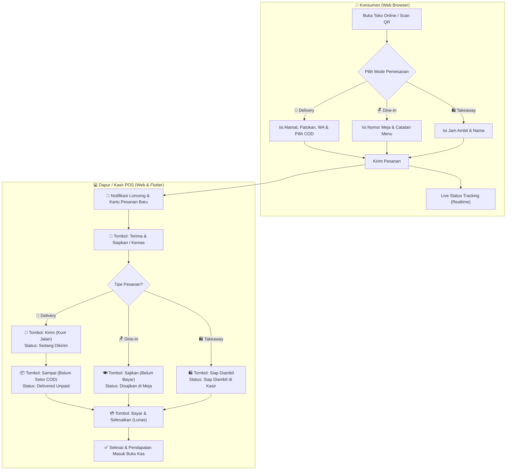

# DuitKu — Aplikasi Manajemen Keuangan Pribadi & Usaha UMKM (POS)

**DuitKu** adalah ekosistem manajemen finansial all-in-one yang terdiri dari **Backend API berbasis CodeIgniter 4**, **Progressive Web App (PWA)**, dan **Aplikasi Mobile Native Flutter (Android)**. 

Dirancang secara modern, cepat, dan mobile-friendly untuk mencatat keuangan pribadi, mengelola multi-rekening dompet, memantau tagihan & hutang, melacak perawatan kendaraan, mengelola **Kasir Cepat Mini (POS), Stok Bahan Baku & Toko Online UMKM**, hingga **Pusat Siaran TV Live Streaming In-App**, **Administrator Hub**, dan **Arcade Mini-Games**.

<p align="center">
  
  
  
  
  
  
  
</p>

---

## 📥 Panduan Unduh & Install APK dari Menu Release GitHub

Bagi pengguna Android yang ingin menginstall aplikasi native DuitKu langsung tanpa build sendiri dari source code:

### 1. Buka Halaman Releases
* Buka tab **[Releases](https://github.com/zusfan-ops/duitku/releases)** pada repository GitHub DuitKu.
* Pilih versi rilis terbaru (Latest Release).

### 2. Pilih File APK yang Sesuai dengan Perangkat Anda

| Nama File APK | Arsitektur CPU | Rekomendasi Penggunaan | Ukuran |
|---|---|---|---|
| **`app-arm64-v8a-release.apk`** | **ARM 64-bit** | ⭐ **Sangat Direkomendasikan** untuk 95%+ smartphone Android modern (keluaran 2018 ke atas: Samsung, Xiaomi, Oppo, Vivo, Realme, dll). Ukuran aplikasi jauh lebih ringan dan performa maksimal. | **~35 MB** |
| **`app-armeabi-v7a-release.apk`** | **ARM 32-bit** | Untuk smartphone Android tipe lama atau entry-level 32-bit. | **~32 MB** |
| **`app-x86_64-release.apk`** | **x86 64-bit** | Untuk emulator Android di PC (NoxPlayer, BlueStacks, LDPlayer, Android Studio Emulator). | **~38 MB** |
| **`app-release.apk`** | **Universal** | Berisi seluruh pustaka arsitektur gabungan (kompatibel untuk segala jenis perangkat Android). | **~82 MB** |

### 3. Langkah-Langkah Pemasangan (Install):
1. **Unduh APK:** Klik salah satu file APK di atas (direkomendasikan `app-arm64-v8a-release.apk`) untuk mulai mengunduh ke ponsel Anda.
2. **Izinkan Instalasi dari Sumber Tak Dikenal:**
   - Buka file APK yang telah diunduh via notifikasi atau File Manager.
   - Jika muncul peringatan keamanan *"Demi keamanan, ponsel Anda tidak diizinkan memasang aplikasi yang tidak dikenal dari sumber ini"*, klik **Setelan (Settings)** $\rightarrow$ aktifkan toggle **"Izinkan dari sumber ini" (Allow from this source)**.
3. **Pasang Aplikasi:** Klik tombol **Install / Pasang**, tunggu proses instalasi selesai, lalu klik **Buka (Open)**.
4. **Login / Registrasi:** Masuk dengan akun yang telah dibuat atau daftar akun baru untuk mulai mencatat.

---

## ✨ Fitur-Fitur Utama & Fungsi Ekosistem DuitKu

### 🛡️ 1. Administrator Hub & Panel Kontrol Terpusat (`/admin`)
*Panel administrasi terpadu khusus untuk pengelola sistem DuitKu dengan keamanan berbasis otorisasi Role Administrator:*
- **Sistem Role & Keamanan Berlapis:** Filter otorisasi `AdminFilter` yang melindungi seluruh rute `/admin/*`. Hanya akun dengan `role = 'administrator'` atau `'admin'` yang dapat mengakses.
- **📊 Dashboard Metrik Global:** Ringkasan total pengguna terdaftar, jumlah akun admin, total transaksi finansial (pemasukan vs pengeluaran), total omset & order POS UMKM, jumlah siaran TV streaming aktif, dan log aktivitas pendaftaran pengguna baru secara realtime.
- **📢 Kirim Notifikasi Broadcast ke Aplikasi (`/admin/notifications`):**
  - Form pengiriman pesan broadcast dengan pilihan tipe: **Info, Pengumuman, Promo, Peringatan, atau Sistem**.
  - Pilihan target penerima: **Semua Pengguna (`all`)** atau **Pengguna Spesifik (`user`)**.
  - Opsi penambahan **Tautan / Action URL** yang dapat langsung diklik oleh pengguna di aplikasi.
  - Opsi **Pin Notifikasi** untuk disematkan sebagai pengumuman prioritas di dashboard aplikasi.
  - Riwayat notifikasi terkirim, fitur pasang/lepas pin, dan hapus notifikasi.
- **📺 Manajemen TV Streaming & M3U Playlist (`/admin/tv`):**
  - Tambah, edit, dan hapus saluran TV Live Streaming.
  - Upload file logo/icon TV langsung dari admin atau gunakan tautan URL logo.
  - **Batch Import Playlist M3U:** Impor otomatis puluhan saluran TV sekaligus dari file `.m3u` atau tempel teks playlist format `#EXTINF`. Sistem otomatis mengekstrak nama channel, icon (`tvg-logo`), kategori (`group-title`), dan URL siaran.
  - **Live Stream Preview Player:** Pemutar video HLS interaktif di panel admin untuk menguji kelancaran siaran sebelum dipublikasikan.
- **👥 Manajemen Pengguna & Hak Akses (`/admin/users`):**
  - Daftar lengkap pengguna terdaftar dengan fitur pencarian instan (nama, email, nomor WhatsApp).
  - Pengubahan hak akses role pengguna secara instan (`User` $\leftrightarrow$ `Administrator`).
  - Fitur reset password pengguna dan hapus akun.

---

### 📺 2. TV Live Streaming In-App Player (Web & Aplikasi Flutter)
*Menikmati siaran televisi langsung dan streaming video tanpa perlu berpindah atau membuka aplikasi browser eksternal:*
- **🎬 Pemutar Video Native In-App (`TvStreamingScreen`):**
  - Menggunakan native engine `video_player` untuk memutar siaran langsung format HLS (`.m3u8` / `.m3u` / HTTP Live Streaming) langsung di dalam aplikasi Flutter.
  - Kontrol pemutar lengkap: **Play / Pause, Mute / Unmute Volume, Reconnect Siaran, dan Status Buffering**.
  - **Mode Layar Penuh (Fullscreen Player):** Tonton siaran televisi dalam orientasi horizontal penuh dengan kontrol minimalis.
- **🌐 Web Player TV Streaming (`/tv`):** Pemutar video streaming HLS.js interaktif rasio 16:9 pada versi web browser dengan tab filter kategori dan kartu channel responsif.
- **Filter Kategori & Pencarian Instan:** Kategorisasi siaran TV (*Nasional, Berita, Hiburan, Olahraga, Religi, Edukasi, dll.*) serta fitur pencarian cepat nama channel.

---

### 📢 3. Pusat Pemberitahuan & Pesan Aplikasi (`NotificationsScreen`)
*Pusat informasi dan komunikasi resmi dari administrator kepada pengguna aplikasi DuitKu:*
- Akses cepat dari tombol lonceng di dashboard utama dan menu Layanan & Fitur.
- Tampilan kartu notifikasi dengan warna tipe khusus (*Info, Pengumuman, Promo, Peringatan, Sistem*).
- Status baca per pengguna (*read receipts*) dan tombol **Tandai Semua Dibaca**.
- Tautan aksi langsung yang dapat membuka halaman tertentu atau URL eksternal.

---

### 🎮 4. DuitKu Arcade Mini-Games Hub
*Fitur hiburan dan edukasi ketangkasan keuangan yang terintegrasi di dalam aplikasi untuk menemani waktu santai:*
- **🧱 Tetris Klasik:** Game susun balok retro dengan kontrol sentuh responsif, skor beruntun, dan fitur pause.
- **🔢 Money 2048:** Game puzzle strategi menggabungkan pecahan uang rupiah (Rp 2.000, Rp 4.000, Rp 8.000 ... hingga Rp 2.048.000).
- **🪙 Coin Catcher:** Game menangkap koin emas yang berjatuhan sebanyak-banyaknya sambil menghindari bom penghancur poin.

---

### 🚀 5. In-App Update Checker & Auto Updater
- Deteksi otomatis ketersediaan versi terbaru aplikasi DuitKu dari GitHub Releases setiap kali aplikasi dibuka.
- Menampilkan dialog informasi rilis (Changelog & Nomor Versi Baru) dan tautan unduh instan APK tanpa perlu membuka browser secara manual.

---

### 🛍️ 6. Suite Usaha, Kasir Mini POS & Marketplace Online Shop (Delivery / Takeaway / Dine-In)
*Khusus dirancang ramah layar sentuh smartphone (*mobile-first*) untuk pengusaha Coffee Shop, Kedai Kopi, Warung Makan, Toko Kelontong, Retail, dan UMKM.*
- **Toko Online & Marketplace Publik UMKM:** Konsumen dapat mengakses toko online dari rumah via tautan web `domain/menu/namatoko` (atau alias `/shop/namatoko` / `/toko/namatoko`) untuk berbelanja produk makanan/sembako kapan saja tanpa perlu login/instal aplikasi.
- **3 Mode Pemesanan Lengkap (*Fulfillment*):**
  1. 🛵 **Delivery (Kirim ke Rumah):** Konsumen memasukkan nama, nomor WhatsApp aktif, alamat pengiriman lengkap, patokan kurir, dan otomatis dihitung ongkos kirim flat toko.
  2. 🛍️ **Takeaway (Ambil di Toko / Pickup):** Konsumen memasukkan nama, nomor WhatsApp, dan estimasi jam pengambilan (*cth: 15 menit lagi / jam 18:30*).
  3. 🪑 **Dine-In (Makan di Tempat):** Konsumen scan QR meja dan memasukkan nomor meja.
- **Pilihan Metode Pembayaran Konsumen:** Mendukung **💵 Bayar di Tempat (COD / Kasir)**, **🏦 Transfer Bank Manual** (menampilkan info nomor rekening pemilik toko), dan **📱 QRIS / E-Wallet**.
- **Cetak Poster & Standee QR Code (PDF):** Cetak kartu nomor meja akrilik/standee siap pasang dengan 3 pilihan bingkai elegan (*Oranye Modern, Klasik Vintage, Dark Minimal*), nama toko, URL link, dan teks instruksi custom.
- **Manajemen Antrean Pesanan Masuk (Live Orders POS):** Pantau pesanan masuk secara realtime dengan filter tab status (*🔔 Baru, 🍳 Diproses/Dikemas, 🛵 Sedang Dikirim, ⚠️ Belum Bayar [COD / Meja], ✅ Selesai, ❌ Batal*) disertai notifikasi bunyi bel lonceng (chime bell).
- **Penanda Khusus Pesanan Belum Bayar (*Served & Delivered Unpaid*):** Visual border emas kontras dan badge khusus agar kasir & kurir dapat dengan mudah membedakan pesanan yang sudah diantar/sampai tapi belum melunasi pembayaran (COD).
- **Live Status Tracking Konsumen Realtime:** Pelanggan dapat memantau status pesanannya secara langsung dari layar HP mereka (*Pesanan Diterima ➔ Sedang Disiapkan / Dikemas ➔ Sedang Dikirim Kurir / Siap Diambil ➔ Pesanan Sampai / COD ➔ Selesai & Lunas*) lengkap dengan tombol hubungi WhatsApp toko dalam 1 ketukan.
- **Kasir Kilat (Point of Sale):** Grid produk touch-friendly, filter kategori instan (*Kopi, Minuman, Makanan, Sembako, dll.*), serta pencarian nama & kode produk.
- **Keranjang Melayang (*Floating Cart Bar*):** Tampilan ringkas total item & harga dengan bottom sheet penyesuaian kuantitas (*stepper +/-*).
- **Checkout Cepat & Kalkulator Kembalian:** Pilihan metode bayar **Tunai (Cash / COD)** dengan tombol nominal cepat (*Uang Pas, 10rb, 20rb, 50rb, 100rb, 200rb*), **QRIS**, **Transfer Bank**, dan **Kasbon Pelanggan**.
- **Struk Thermal & Kirim WhatsApp:** Pratinjau struk digital kasir yang dapat langsung dicetak ke printer thermal Bluetooth (58mm / 80mm) atau dikirim ke WhatsApp pelanggan dengan format struk rapi dalam satu ketukan.
- **🖨️ Cetak Struk Bluetooth Thermal POS (58mm / 80mm ESC/POS):** Halaman dan modal cetak nota kasir monospaced thermal siap pakai dengan rincian varian topping, kode kupon diskon, ongkir delivery, metode pembayaran, kembalian, dan ucapan terima kasih.
- **🧾 Smart OCR Scan Struk Belanja Otomatis (*Receipt Scanner*):** Cukup foto atau unggah struk belanja (Indomaret, Alfamart, SPBU, Restoran, Swalayan), sistem otomatis mendeteksi total nominal, tanggal transaksi, nama toko/merchant, dan mengelompokkan kategori pengeluaran secara cerdas tanpa perlu mengetik manual.
- **💼 Rekonsiliasi Shift Kasir & Laci Uang (*Cash Drawer Settlement*):** Pengelolaan shift kerja kasir dengan input modal awal kas (*starting cash float*), kalkulasi otomatis uang kas masuk, dan rekonsiliasi uang fisik nyata saat tutup shift kasir untuk mendeteksi selisih kas (*cash shortage / overage*).
- **📦 Manajemen Stok Bahan Baku & Resep Menu (Bill of Materials - BOM):** Manajemen persediaan bahan mentah (kopi, susu, sirup, kemasan, dll.) yang terhubung dengan menu produk. Stok bahan baku otomatis terpotong saat transaksi kasir/toko online berhasil dibuat, dilengkapi kalkulator estimasi HPP bahan dan *low ingredient alerts*.
- **👥 Dompet Bersama & Multi-User Collaboration (*Shared Wallet*):** Kolaborasi pencatatan dompet/rekening kas bersama pasangan, keluarga, atau tim bisnis toko. Dilengkapi pengaturan peran (*Editor / Viewer*) dan pelacakan pencatat transaksi.
- **💱 Multi-Currency Converter & Kurs Valas Real-Time:** Kalkulator kurs valuta asing instan (USD, SGD, MYR, SAR untuk Umroh/Haji, JPY, EUR, GBP, AUD, CNY, KRW, THB) terintegrasi pada modul Traveling dan personal finance.
- **🛡️ Keamanan Sistem (*Security Hardened*):** Perlindungan menyeluruh dari serangan SQL Injection (parameterized queries), CSRF Protection global, pemblokiran eksekusi skrip di folder upload via `.htaccess` (RCE Prevention), Brute-Force Rate Limiting (10 req/menit), pencegahan Session Fixation, dan HTTP Security Headers (*X-Frame-Options, X-Content-Type-Options: nosniff*).
- **Manajemen Katalog, Stok & HPP:** Pengaturan harga jual vs harga modal (HPP), batas minimum stok (*low stock alert*), modal restock cepat, serta otomatisasi potong stok saat checkout pesanan.
- **Buku Kasbon Pelanggan Terintegrasi:** Pembayaran kasbon otomatis tercatat di modul piutang (`debts`) dengan rincian nama, nomor WhatsApp, dan jatuh tempo penagihan.
- **Laporan Laba Rugi Usaha (P&L):** Menghitung otomatis $\text{Omset} - \text{HPP (Modal)} = \mathbf{Laba\ Bersih}$, rata-rata per pesanan, rincian metode pembayaran, dan ranking **5 Produk Terlaris (*Top 5 Best Sellers*)**.

---

### 🚗 7. Pencatat Armada & Kendaraan Pribadi
- **Multi-Armada:** Kelola mobil, sepeda motor, truk/pickup barang, dan sepeda listrik lengkap dengan nomor plat, merk/tipe, tahun, dan odometer (KM).
- **Riwayat Servis & Ganti Oli:** Catatan servis berkala, ganti oli mesin/gardan, penggantian sparepart, cuci, ban, dan BBM dengan rincian biaya & bengkel.
- **Pengingat Pajak STNK:** Pemantauan tanggal jatuh tempo Pajak Tahunan & Pajak 5 Tahunan (Plat Kaleng) dengan notifikasi otomatis.

---

### 🔔 8. Notifikasi Pengingat Jatuh Tempo Cerdas
- **Agregasi Multi-Sumber:** Sistem memindai 4 jenis kewajiban yang mendekati jatuh tempo:
  1. 📋 **Daftar Tagihan Rutin** (Listrik, Air, Wifi, Kontrakan).
  2. 💸 **Hutang & Piutang** (Pinjaman & penagihan kasbon).
  3. 🚗 **Pajak Kendaraan & Servis** (Jatuh tempo pajak STNK).
  4. 🔄 **Transaksi Berulang** (Langganan & tagihan berkala).
- **Badge Counter & Alarm:** Ikon lonceng notifikasi dengan badge merah di topbar PWA & Flutter, banner darurat jika ada tagihan jatuh tempo hari ini/lewat, serta Web Browser Notification API.

---

### 🔄 9. Transaksi Rutin & Eksekusi Otomatis
- Penjadwalan transaksi berulang harian, mingguan, bulanan, atau tahunan.
- **Tombol "Bayar Sekarang":** Memungkinkan pengguna langsung membayar tagihan berulang dalam 1 klik — otomatis memotong saldo rekening yang dipilih, mencatat mutasi pengeluaran, dan memajukan tanggal jatuh tempo berikutnya.

---

### 🎯 10. Target Tabungan Multi-Goal
- Buat berbagai target impian finansial (*Beli Rumah, Dana Darurat, Beli Gadget, Qurban, dll.*).
- Visual progress bar pencapaian, sisa hari, dan setor dana tabungan kapan saja.

---

### 🧳 11. Traveling & Itinerary Trip Planner
- Penyusunan anggaran liburan/perjalanan dinas, pencatat tiket transportasi & voucher hotel digital, serta checklist barang bawaan.

---

### 📦 12. Inventaris & Lokasi Penyimpanan Barang
- Pencatatan barang fisik berharga beserta **lokasi penyimpanan spesifik** (lemari, rak, box gudang) dan foto dokumentasi offline agar tidak lupa letak barang.

---

### 👛 13. Manajemen Multi-Dompet & Mutasi Saldo
- Kelola dompet tunai, rekening bank (BCA, Mandiri, BRI, BNI), dan e-wallet (GoPay, OVO, Dana, ShopeePay).
- Fitur transfer antar-dompet dengan penyesuaian saldo otomatis.

---

### 📊 14. Analisis Statistik & Export Laporan
- Grafik visual arus kas pemasukan vs pengeluaran dan kategori pengeluaran terbesar.
- **Export Laporan:** Cetak dokumen laporan keuangan ke format **PDF** dan unduh data spreadsheet **CSV / Excel**.

---

### 👨‍💻 15. Informasi Profil Pengembang
- Halaman informasi developer terintegrasi di PWA dan Native App yang menampilkan profil, pencapaian, rekam jejak inovasi teknologi, dan tautan kontak langsung WhatsApp.

---

## 📖 Panduan Penggunaan & Simulasi Skenario



---

## 🏗️ Arsitektur & Teknologi

```
DuitKu Ecosystem
├── Backend REST API : CodeIgniter 4 (PHP 8.2+, MySQL 8, Token-based Auth)
├── Web / PWA Client : HTML5 Semantic, Modern Vanilla CSS Design Tokens, JavaScript ES6+, HLS.js
└── Native Mobile App: Flutter 3.44+, Dart 3.12+, Provider State Management, VideoPlayer, Material 3
```

---

## 👨‍💻 Profil Developer

<table>
  <tr>
    <td width="140" valign="top">
      
    </td>
    <td valign="top">
      <h3>Zusfan Mashuri</h3>
      <p>
        <strong>Marketing Strategist · IT Builder · Public Service Innovator</strong>
      </p>
      <p>
        Founder & Marketing IT Director di <a href="https://hallosemarang.com" target="_blank">Hallo Semarang</a>. 
        Pengembang sistem digital dengan pengalaman di marketing strategi, infrastruktur IT, smart city, 
        dan pemberdayaan UMKM & komunitas melalui teknologi.
      </p>
      <p>
        <a href="https://wa.me/628998813000" target="_blank">
          
        </a>
        <a href="https://zusfan.hallosemarang.com/" target="_blank">
          
        </a>
        <a href="https://hallosemarang.com" target="_blank">
          
        </a>
        <a href="https://zusfan.hallosemarang.com/resume.html" target="_blank">
          
        </a>
      </p>
    </td>
  </tr>
</table>

### 🎯 Pencapaian Highlight
- 🚀 Mengembangkan platform berita digital **Hallo Semarang** dengan **100,000+ pembaca bulanan** dan pertumbuhan traffic organik **200% dalam 6 bulan**.
- 🌐 Implementasi **WiFi gratis di 50+ lokasi publik** sebagai bagian program Smart City Semarang.
- 📡 Membangun infrastruktur **TV streaming (GETTV)** di Lombok, **videotron advertising centralized** di Alun-Alun Klaten, dan **sistem VoIP** organisasi.
- 🤝 Memfasilitasi digitalisasi dan pemberdayaan ratusan pelaku UMKM melalui solusi teknologi praktis.

---

## 📄 Lisensi

Perangkat lunak **proprietary/internal**. Dibangun di atas:
- [CodeIgniter 4](https://codeigniter.com) (lisensi MIT)
- [Flutter](https://flutter.dev) (lisensi BSD-3-Clause)

<p align="center"><sub>DuitKu · Personal & Business Finance Suite · Developed by Zusfan Mashuri</sub></p>
